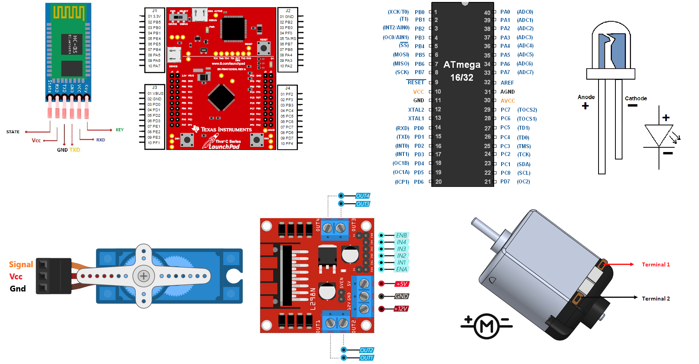

# Dual-Node Wireless Control System

This project involves the development of a dual-node wireless control system utilizing a Tiva C microcontroller as the master node and an AVR ATmega32 microcontroller as the slave node. The system is designed to receive commands via Bluetooth through an HC-05 module, interfaced with the Tiva C via UART. The master node processes the received data and communicates with the slave node using the SPI protocol. The project demonstrates the control of various peripherals, including a servo motor for door operations, LEDs, and a DC motor. The servo motor, connected to the master node, executes open and close commands, while the slave node, controlled by the AVR kit, manages LED indicators and the DC motor. This project showcases the integration of wireless communication, multi-node coordination, and real-time control within an embedded systems environment.

# Master Node (Tiva C Microcontroller)

**1. Bluetooth Communication Interface:**

HC-05 Module: The master node is equipped with an HC-05 Bluetooth module connected via UART. This module facilitates wireless communication with a mobile device, allowing the system to receive commands such as door control, LED activation, and DC motor operation.
UART Configuration: The UART interface on the Tiva C must be configured for reliable data transmission and reception, ensuring seamless communication with the HC-05 module.

**2. Servo Motor Control:**

PWM Signal Generation: The Tiva C microcontroller generates a PWM signal to control a servo motor responsible for opening and closing a door. The PWM signal must be precisely configured to achieve the required angular movement of the servo.
Angle Control Logic: The master node interprets received commands and adjusts the PWM duty cycle to set the servo motor to the appropriate angle for door operation.

**3. Inter-Node Communication:**

SPI Protocol: The master node uses the SPI protocol to communicate with the slave node (AVR ATmega32). This communication must be synchronized to ensure that commands are accurately relayed and executed by the slave node.
Command Parsing: The Tiva C microcontroller must parse incoming commands and translate them into SPI messages that the slave node can interpret and act upon.

---

# Slave Node (AVR ATmega32 Microcontroller)

**1. SPI Communication Interface:**

SPI Slave Configuration: The AVR ATmega32 microcontroller acts as the slave in the SPI communication setup. It must be configured to receive and respond to commands from the master node accurately.
Command Interpretation: The slave node interprets SPI messages from the master node and executes corresponding actions such as controlling LEDs or operating the DC motor.

**2. LED Control:**

GPIO Configuration: The slave node controls LEDs connected to its GPIO pins. It must be configured to turn these LEDs on or off based on the commands received via SPI.
Indicator Logic: The AVR microcontroller may need to implement logic to handle different LED patterns or statuses, as dictated by the master node.

**3. DC Motor Control:**

Motor Driver Interface: The DC motor is controlled by the slave node, which interfaces with a motor driver circuit. The microcontroller must send appropriate signals to the driver to start, stop, or adjust the motor's speed and direction.
PWM or GPIO Control: Depending on the motor driver, the slave node may use PWM signals for speed control or simple GPIO toggling for on/off control.

---

# Components used in project:

---

# How to Connect The Main Node (Tiva C MCU) and Secondary Node (AVR ATmega32 MCU) With Other Components:

**1. Main Node (Tiva C MCU) Connections**

1.1 HC-05 Bluetooth Module:
The HC-05 Bluetooth module is connected to the Tiva C microcontroller to enable wireless communication with external devices, such as a smartphone.

UART Communication:

    TXD Pin: Connect to UART5_RX (Pin PE4).
    RXD Pin: Connect to UART5_TX (Pin PE5).

    Power and Ground:
    VCC Pin: Connect to VBUS pin on the Tiva C board.
    GND Pin: Connect to a GND pin on the Tiva C board.

1.2 Servo Motor
The servo motor is connected to the Tiva C microcontroller to control mechanical movement, such as opening or closing a door.

    Power and Ground:
    VCC Pin: Connect to VBUS pin on the Tiva C board.
    GND Pin: Connect to a GND pin on the Tiva C board.

    Control Signal:
    Signal Pin: Connect to PF1 (PWM) on the Tiva C board.

1.3 SPI Communication with Secondary Node (AVR ATmega32 MCU)
The Tiva C microcontroller communicates with the Secondary Node using the SPI1 interface.

    SPI Connections:
    SCLK (Serial Clock): Connect SPI1_SCLK (Pin PD0) on Tiva C to the corresponding SPI clock pin on the AVR MCU.
    MISO (Master In Slave Out): Connect SPI1_MISO (Pin PD3) on Tiva C to the corresponding SPI MISO pin on the AVR MCU.
    MOSI (Master Out Slave In): Connect SPI1_MOSI (Pin PD1) on Tiva C to the corresponding SPI MOSI pin on the AVR MCU.
    SS (Slave Select): Connect SPI1_SS (Pin PD2) on Tiva C to the corresponding SPI SS pin on the AVR MCU.

**2. Secondary Node (AVR ATmega32 MCU) Connections**

2.1 LEDs The Secondary MCU controls three LEDs, which are connected to specific GPIO pins.

    LED 1:
    Anode Pin: Connect to Pin C7 on the AVR MCU.
    Cathode Pin: Connect to a GND pin via a current-limiting resistor.

    LED 2:
    Anode Pin: Connect to Pin C0 on the AVR MCU.
    Cathode Pin: Connect to a GND pin via a current-limiting resistor.

    LED 3:
    Anode Pin: Connect to Pin D3 on the AVR MCU.
    Cathode Pin: Connect to a GND pin via a current-limiting resistor.

2.2 DC Motor (Controlled by L298N Motor Driver Shield)

    The DC motor is controlled via the L298N motor driver shield, which interfaces with the AVR ATmega32 MCU.

    Motor Driver Connections:
    IN1 Pin: Connect to Pin B0 on the AVR MCU.
    IN2 Pin: Connect to Pin B1 on the AVR MCU.
    PWM Pin: Connect to the PWM pin on the AVR MCU.

    Power Supply:
    VCC and Ground: Connect the L298N motor driver shield to an external battery for power.

---

# Application Flow Description

**The dual-node wireless control system project is designed to allow a mobile phone to control various hardware components via a wireless Bluetooth connection, utilizing the HC-05 Bluetooth module paired with the Main Node, which is a Tiva C microcontroller. The system enables seamless communication between the mobile phone, the Main Node, and a Secondary Node, which is an AVR ATmega32 microcontroller, to execute specific tasks.**

---

**Step 1: Bluetooth Pairing and Data Transmission**

    Initially, the mobile phone pairs with the HC-05 Bluetooth module connected to the Main Node. This pairing process can be easily accomplished using a standard serial terminal application available on the Google Play Store. Once the pairing is successful, the user can send commands directly from the mobile phone to the Main Node via the serial terminal app. The communication between the mobile phone and the HC-05 module occurs over the UART protocol, ensuring reliable data transmission.

**Step 2: Data Reception and Processing by the Main Node**

    Upon receiving data from the HC-05 module, the Main Node processes the incoming commands. The data is transmitted over the UART interface, where the Main Node constantly monitors the UART channel for any incoming communication. When a command is detected, the Main Node retrieves the data and begins the process of interpreting its meaning and determining the appropriate course of action.

**Step 3: Command Execution or Transfer**
Once the Main Node has successfully received and interpreted the command, it takes one of two possible actions based on the content of the data:

        1. Local Execution on Main Node:
            If the command pertains to hardware components directly connected to the Main Node, such as controlling a servo motor for opening or closing a door, the Main Node immediately executes the command. For example, if the command instructs the servo motor to rotate to a specific angle, the Main Node will generate the appropriate PWM signal to achieve the desired motion.

        2. Command Transfer to Secondary Node:
            If the command is intended for the hardware components connected to the Secondary Node (e.g., LEDs or DC motor), the Main Node transfers the command via the SPI protocol. The Main Node acts as the master in the SPI communication, sending the command data to the Secondary Node, which acts as the slave. The Secondary Node, upon receiving the command, decodes it and executes the required action, such as turning on an LED or controlling the speed and direction of the DC motor.

**Step 4: Error Handling and Command Validation**

    Throughout the process, the Main Node incorporates robust error handling mechanisms. If the received command data is invalid, unrecognized, or does not match any predefined operation, the Main Node will ignore the command. The system is designed to disregard erroneous data to prevent unintended actions. After dismissing the invalid command, the Main Node resumes its waiting state, ready to receive and process the next valid command from the mobile phone.

---
