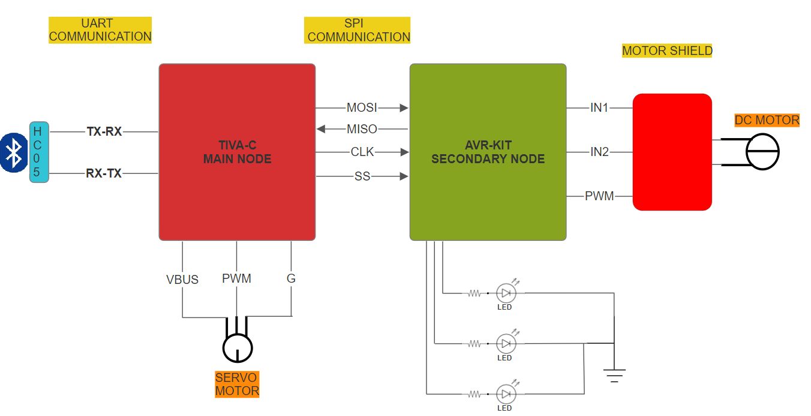

# Dual-Node Wireless Control System

This project involves the development of a dual-node wireless control system utilizing a Tiva C microcontroller as the master node and an AVR ATmega32 microcontroller as the slave node. The system is designed to receive commands via Bluetooth through an HC-05 module, interfaced with the Tiva C via UART. The master node processes the received data and communicates with the slave node using the SPI protocol. The project demonstrates the control of various peripherals, including a servo motor for door operations, LEDs, and a DC motor. The servo motor, connected to the master node, executes open and close commands, while the slave node, controlled by the AVR kit, manages LED indicators and the DC motor. This project showcases the integration of wireless communication, multi-node coordination, and real-time control within an embedded systems environment.

Master Node (Tiva C Microcontroller)

1. Bluetooth Communication Interface:

   HC-05 Module: The master node is equipped with an HC-05 Bluetooth module connected via UART. This module facilitates wireless communication with a mobile device, allowing the system to receive commands such as door control, LED activation, and DC motor operation.
   UART Configuration: The UART interface on the Tiva C must be configured for reliable data transmission and reception, ensuring seamless communication with the HC-05 module.

2. Servo Motor Control:

   PWM Signal Generation: The Tiva C microcontroller generates a PWM signal to control a servo motor responsible for opening and closing a door. The PWM signal must be precisely configured to achieve the required angular movement of the servo.
   Angle Control Logic: The master node interprets received commands and adjusts the PWM duty cycle to set the servo motor to the appropriate angle for door operation.

3. Inter-Node Communication:

   SPI Protocol: The master node uses the SPI protocol to communicate with the slave node (AVR ATmega32). This communication must be synchronized to ensure that commands are accurately relayed and executed by the slave node.
   Command Parsing: The Tiva C microcontroller must parse incoming commands and translate them into SPI messages that the slave node can interpret and act upon.

4. System Coordination:

   Real-Time Processing: The master node manages the overall system coordination, ensuring that operations such as door control, LED activation, and motor operation are executed in real-time and in the correct sequence.

Slave Node (AVR ATmega32 Microcontroller)

5. SPI Communication Interface:

   SPI Slave Configuration: The AVR ATmega32 microcontroller acts as the slave in the SPI communication setup. It must be configured to receive and respond to commands from the master node accurately.
   Command Interpretation: The slave node interprets SPI messages from the master node and executes corresponding actions such as controlling LEDs or operating the DC motor.

6. LED Control:

   GPIO Configuration: The slave node controls LEDs connected to its GPIO pins. It must be configured to turn these LEDs on or off based on the commands received via SPI.
   Indicator Logic: The AVR microcontroller may need to implement logic to handle different LED patterns or statuses, as dictated by the master node.

7. DC Motor Control:

   Motor Driver Interface: The DC motor is controlled by the slave node, which interfaces with a motor driver circuit. The microcontroller must send appropriate signals to the driver to start, stop, or adjust the motor's speed and direction.
   PWM or GPIO Control: Depending on the motor driver, the slave node may use PWM signals for speed control or simple GPIO toggling for on/off control.
